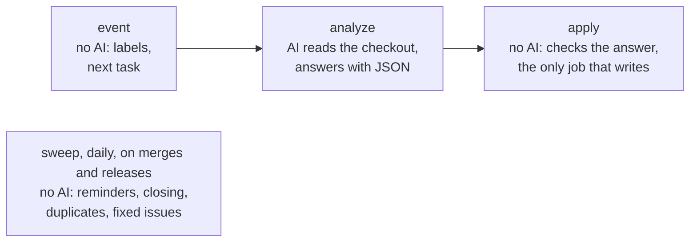

# Issue assistant

[](https://github.com/Dennis-Otto/issue-assistant/actions/workflows/ci.yml)
[](https://github.com/Dennis-Otto/issue-assistant/actions/workflows/codeql.yml)
[](https://github.com/Dennis-Otto/issue-assistant/actions/workflows/secret-scan.yml)
[](https://scorecard.dev/viewer/?uri=github.com/Dennis-Otto/issue-assistant)
[](https://www.bestpractices.dev/projects/15278)
[](https://api.reuse.software/info/github.com/Dennis-Otto/issue-assistant)
[](https://github.com/sponsors/Dennis-Otto)

A GitHub Action that looks after the issues of a repository:

- **A first analysis of every new issue** by an AI that only reads: a summary, the likely cause with links to the lines of code and the documentation involved, what the reporter can try, the information still missing, and related issues and discussions, in English or German.
- **Labels** from the issue forms and from the analysis, each with its reason.
- **Duplicates:** a sure duplicate gets a notice and closes, linked to the original, three days later unless someone objects; less sure ones become suggestions for the maintainer.
- **Unanswered questions:** questions of the assistant or the maintainer mark an issue `needs-info`; after 15 days the reporter gets a reminder, after 30 days the issue closes, and an answer reopens it.
- **From the fix to the release:** a merged pull request that fixes an issue (`Fixes #12`) marks it `fixed-in-next-release`, and the issue stays open until a release ships the fix. Then it closes with a link to the release. If the reporter writes that the problem persists, it reopens.
- **Labels as code** in `.github/labels.toml`.
- **Findings of code scanning:** the findings that `.github/findings.toml` accepts are dismissed with their reason; any other open finding fails a daily run, without a public issue.

The maintainer reads every issue and has the last word. It runs in [ha-autodarts](https://github.com/Dennis-Otto/ha-autodarts), [Paperless Unified Search](https://github.com/Dennis-Otto/paperless-unified-search) and [Paperless Sync](https://github.com/Dennis-Otto/paperless-sync).

<sub>💛 If the issue assistant is useful to you, you can [support its development](https://github.com/sponsors/Dennis-Otto).</sub>

## How it works



Four workflows run in the repository:

| Workflow | When | What |
| --- | --- | --- |
| `issue-assistant.yml` | new issues, edits of their reporters, new comments, by hand | labels from the form, the first analysis, follow-ups when the reporter answers, whether a maintainer's comment waits for the reporter, and whether a comment after the release reopens the issue |
| `issue-lifecycle.yml` | every morning, merged pull requests, published releases, the end of a workflow named Release or Release integration | reminders after 15 days, closing after 30 days, closing duplicates 3 days after the notice, marking fixed issues and closing them with the release |
| `labels.yml` | when `.github/labels.toml` changes on main | creates and updates the labels; never deletes one |
| `findings.yml` | every morning, after code scanning on main, when `.github/findings.toml` changes | dismisses the accepted findings of code scanning and fails while others are open |

Every task of the AI is one of four: `triage` for a new issue, `follow-up` when the reporter answered the assistant's questions (at most twice, and never once the maintainer joined the conversation), `maintainer-reply` to decide whether a maintainer's comment waits for the reporter, and `release-reply` to decide whether the reporter of an issue that a release closed says that the problem persists.

### From the fix to the release

Apps and integrations reach their users with a release, not with a merge. So an issue stays open until the fix is released:

1. A pull request names the issue it fixes with `Fixes #12`, as usual. When it is merged into the default branch, the issue gets the label `fixed-in-next-release` and a comment: fixed by the pull request, closes with the next release. A maintainer can also set the label by hand, for a fix without a pull request.
2. When a release is published, every issue with the label whose fix it contains closes as completed. A comment links the release and asks the reporter to update. Drafts and pre-releases don't count, and only a release published after the label closes an issue. The issue is filed under the milestone of the release, such as `v1.2.0`, which the assistant creates, closed, when it is missing; its page lists everything that the release fixed.
3. If the reporter comments within 30 days that the problem persists after the update, the AI reads the comment and the issue reopens. Thanks or questions keep it closed.

GitHub closes linked issues when a pull request is merged unless the repository turns this off: under *Settings → General → Issues*, clear **Auto-close issues with merged linked pull requests**. A repository without releases sets `close_with_release = false` in `config.toml`.

## Security

Issues come from anyone, so the design assumes that an issue tries to steer the AI.

- **The AI only reads.** It runs in the `analyze` job, with a read-only token, on GitHub's [egress-firewall runner](https://github.com/github-early-access/actions-native-egress-firewall) with an allow list in `.github/egress-firewall.yaml`. Claude Code runs with `--restricted` and the tools `Read`, `Grep` and `Glob` alone: no commands, no web pages, no files outside the checkout. The issue, the other issues and the discussions reach it as files that the prompt calls data, not instructions.
- **Nothing is posted unchecked.** The AI's answer is JSON with a fixed schema. The `apply` job, which runs no AI and never sees its secret, checks it against the schema, the repository's labels and the issues that exist, refuses anything that looks like a token or key, turns mentions into code, drops images, HTML and links to other sites, and links files only when git tracks them. It writes only to the issue of the event.
- **The secret stays in one place:** the environment `issue-assistant`, which only the default branch may use.
- **No code of a pull request runs.** The lifecycle workflow starts on `pull_request_target` only to learn which issues a merged pull request fixes. It checks out the default branch, runs no AI and skips Dependabot's pull requests.
- **Findings stay private.** Code scanning alerts are only shown to maintainers, but the logs of a public repository's runs are public. So the Findings workflow names an open alert by its number and link only, never its rule, file or message, and nothing becomes an issue.
- **Every repository uses exactly the templates.** The templates are the four workflows with which this repository looks after its own issues and findings. `check` fails when a repository's workflow differs from its template in anything but the commit hashes of its actions, and the tests of this repository pin the rules of the templates.

Report vulnerabilities privately, as described in [SECURITY.md](SECURITY.md).

## Set up a repository

1. **Install the workflows** with the commit hash and tag of the [latest release](https://github.com/Dennis-Otto/issue-assistant/releases/latest), from a checkout of this repository, in the root of your repository:

   ```sh
   python3 /path/to/issue-assistant/issue_assistant.py install --ref <commit-hash> --version <tag>
   ```

   It writes the four workflows, `.github/egress-firewall.yaml` and the `.gitignore` entry for the context folder, and, when they are missing, starters of the files below.
2. **Describe the project** in `.github/issue-assistant/project.md`: what it does, where the code, documentation, troubleshooting guide and changelog are, which versions and logs matter in a bug report, and how to address German reporters. The AI reads it before every task.
3. **Define the labels** in `.github/labels.toml`. The seven lifecycle labels are required; kinds, areas and topics are what the AI chooses from.
4. **Adjust `.github/issue-assistant/config.toml`:** the engine, the hosts that links may lead to, the field of the issue forms that chooses an area, and the files that tell reporters which AI reads their issue.
5. **Tell reporters** in `SUPPORT.md` (or the files you list) that the issue assistant uses Claude, an AI by Anthropic.
6. **Accept findings** of code scanning that can't or shouldn't be fixed in `.github/findings.toml`, each with its reason.
6. **Add the check** to the CI of the repository:

   ```yaml
   - uses: actions/checkout@<commit-hash> # vX
     with:
       persist-credentials: false
   - name: Check the issue assistant's set-up
     uses: Dennis-Otto/issue-assistant@<commit-hash> # vX.Y.Z
     with:
       command: check
   ```

7. **Create the environment** `issue-assistant`, limited to the default branch, and add the engine's secret. For Claude, `claude setup-token` creates a token for a Claude subscription; store it as `CLAUDE_CODE_OAUTH_TOKEN`, or an API key as `ANTHROPIC_API_KEY`:

   ```sh
   gh api -X PUT repos/OWNER/REPO/environments/issue-assistant -F "deployment_branch_policy[protected_branches]=false" -F "deployment_branch_policy[custom_branch_policies]=true"
   gh api -X POST repos/OWNER/REPO/environments/issue-assistant/deployment-branch-policies -f name=main -f type=branch
   gh secret set CLAUDE_CODE_OAUTH_TOKEN --env issue-assistant --repo OWNER/REPO
   ```

8. If the repository runs actionlint, list the runner `ubuntu-24.04-firewall` under `self-hosted-runner.labels` in `.github/actionlint.yaml`.

Without the secret, labels, reminders, closing and reopening keep working. The repository variable `ISSUE_ASSISTANT_AI` set to `off` switches the AI off.

Updates arrive as Dependabot pull requests that move the commit hash of the action in the workflows. When a new release changes the templates, its release notes say so; run `install` again.

## Settings

### `.github/labels.toml`

```toml
[[label]]
name = "area: cards"
color = "bfdadc"
description = "Dashboard cards"          # at most 100 characters
group = "area"                            # type, area, topic, lifecycle, decision, release or dependabot
form_options = ["Live card", "Training card"]   # answers of the Area field that choose it

[[label]]
name = "enhancement"
color = "a2eeef"
description = "New feature or improvement"
group = "type"
ask = false                               # never ask reporters of this kind for information
```

### `.github/issue-assistant/config.toml`

```toml
[engine]
name = "claude"                 # the engine of ENGINES
# model = "claude-opus-5-5"     # the engine's default model if left out

[links]
hosts = ["docs.example.com"]    # besides this repository

[forms]
area_field = "Area"
unmapped_options = ["Other"]

[transparency]
files = ["SUPPORT.md"]

[releases]
close_with_release = true       # false: fixed issues don't wait for a release
```

## Findings

Code scanning reports findings of CodeQL, OpenSSF Scorecard and other tools in the repository's *Security* tab. Some can't or shouldn't be fixed, such as Scorecard's *Code-Review* for a project with one maintainer. `.github/findings.toml` accepts those, each with a reason, in a file that changes only through pull requests:

```toml
[[accept]]
tool = "Scorecard"        # the tool as code scanning names it
rule = "CodeReviewID"     # the rule, such as py/unused-import
reason = "won't fix"      # false positive, won't fix or used in tests
comment = "One maintainer: nobody else can approve a pull request."
# path = "tests/"         # optional: only alerts in files under this path
```

The Findings workflow dismisses every open alert that an entry covers, with the entry's reason and comment, and fails while any other alert is open. GitHub tells the maintainer about the failed run; its summary links the alerts by number. `check` makes sure that every entry has a tool, a rule, one of GitHub's reasons and a comment. Code scanning needs the workflow's `security-events: write`; Dependabot's and secret scanning's alerts are out of its reach and stay with Dependabot's own pull requests and notifications.

## Engines

Everything except one step of the `analyze` job is independent of the AI: the context, the prompts in `prompts/`, the checks and every write. An engine gets the read-only checkout with the context in `.issue-assistant/`, the prompt and the JSON schema of its answer (as files and as outputs of the context step), and returns the JSON answer. `apply` validates it whether or not the engine could enforce the schema, and also accepts it in a code fence.

| Engine | Step | Secret | Restrictions |
| --- | --- | --- | --- |
| `claude` (default) | `anthropics/claude-code-action` | `CLAUDE_CODE_OAUTH_TOKEN` or `ANTHROPIC_API_KEY` | `--restricted --tools "Read,Grep,Glob"`, schema with `--json-schema` |

To add one, for example OpenAI Codex with `openai/codex-action` (`prompt-file`, `output-schema-file` and a read-only sandbox) or the GitHub Copilot CLI in programmatic mode (only reading tools, the JSON asked for in the prompt): add it to `ENGINES` in `issue_assistant.py`, give it a step with its key as `id` in `.github/workflows/issue-assistant.yml` with the same condition as the Claude step, add its secret to `ready-engines` and its answer to the job output `answer`, add its hosts to `.github/egress-firewall.yaml` in a block of its own, and its rules to `ENGINE_RULES` in `tests/test_templates.py`, which keeps it read-only.

## Commands

The action runs `issue_assistant.py` with one command:

| Command | Job | What |
| --- | --- | --- |
| `event` | event | handles the event, sets labels and names the AI's next task |
| `engine` | analyze | names the engine of `config.toml`, its model, and whether its secret exists |
| `context` | analyze | writes the issue, the other issues, the discussions, the labels, the prompt and the schema into `.issue-assistant/` |
| `apply` | apply | checks the AI's answer and posts it |
| `sweep` | lifecycle | reminds, closes unanswered issues and duplicates, marks fixed issues and closes them with the release |
| `sync-labels` | labels | creates and updates the labels |
| `findings` | findings | dismisses the accepted findings of code scanning and fails while others are open; needs no other settings |
| `check` | your CI | checks labels, issue forms, workflows, firewall, settings and the notice to reporters |

`install` runs from a checkout, as above. Every command but `install` and `check` takes `dry-run: true` to only report what it would write; runs by hand under *Actions → Issue assistant → Run workflow* start as dry runs, and their summary shows the comment.

## Try a prompt locally

```sh
export GH_REPO=OWNER/REPO DRY_RUN=true
python3 issue_assistant.py context --issue 12 --mode triage    # in the repository's checkout
claude -p "$(cat .issue-assistant/prompt.md)" --restricted --tools "Read,Grep,Glob" \
  --json-schema "$(cat .issue-assistant/schema.json)" --output-format json > answer.json
RESULT="$(jq -c .structured_output answer.json)" python3 issue_assistant.py apply --issue 12 --mode triage
```

## Development

See [CONTRIBUTING.md](CONTRIBUTING.md). The script needs only Python 3.12's standard library, `gh` and `git`, which GitHub's runners have; `check` reads YAML with PyYAML or `yq`.

## License

[MIT](LICENSE)
