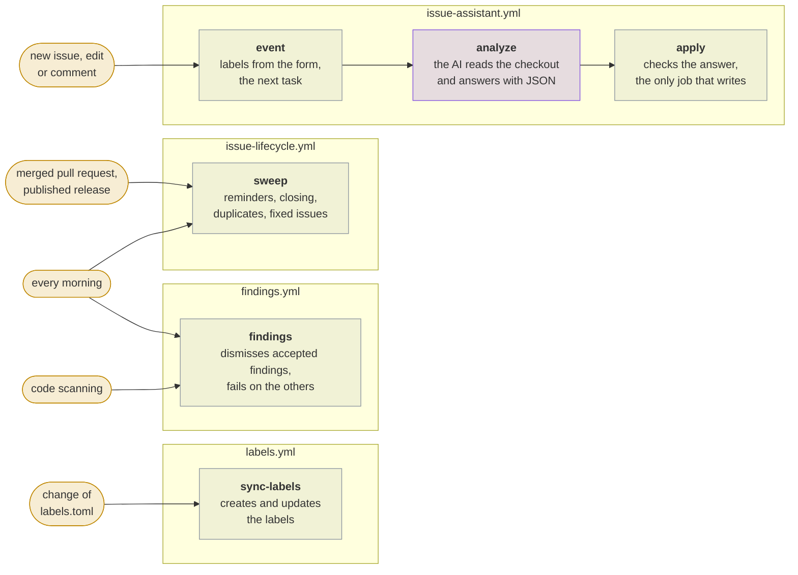
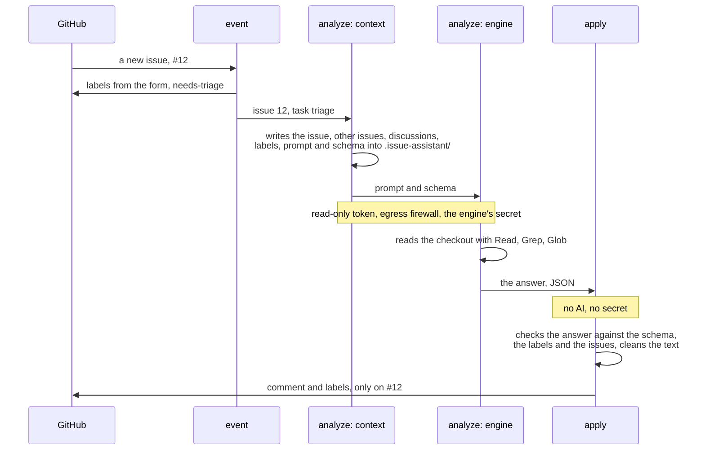

# Architecture

[← README](https://github.com/Dennis-Otto/issue-assistant) · [Security design](security.md) · [Roadmap](roadmap.md)

The issue assistant is a composite GitHub Action. `action.yml` runs `issue_assistant.py` with the Python 3.12 of GitHub's runners and the standard library alone; the script talks to GitHub through the GitHub CLI. Four workflows in the repository that it looks after call the action, and one step of one job runs the AI engine.

## Components

| Component | Files | What it does |
| --- | --- | --- |
| The action | `action.yml` | Passes every input through the environment to `issue_assistant.py` and runs one command of it |
| Commands | `main()` in `issue_assistant.py` | `event`, `engine`, `context`, `apply`, `sweep`, `sync-labels`, `findings`, `check` and `install`; [the README](https://github.com/Dennis-Otto/issue-assistant#commands) names what each does |
| GitHub client | the class `GitHub` | Every read and write through `gh api`; in a dry run it only records what it would write |
| Settings | `load_config`, `load_labels`, `load_findings` | Read `.github/issue-assistant/config.toml`, `.github/labels.toml` and `.github/findings.toml` of the repository |
| Events | `handle_event` | Labels from the issue forms, and the next task of the engine: `triage`, `follow-up`, `maintainer-reply` or `release-reply` |
| Context | `write_context` | Writes the issue, its comments, related issues and discussions, the labels, the prompt and the JSON schema of the answer into `.issue-assistant/`, for the engine to read |
| Prompts | `prompts/` | The rules of every task, which call the content of the issue data, not instructions |
| Checks of the answer | `answer_schema`, `validate`, `parse_answer`, `looks_secret`, `sanitize` | Check the engine's JSON against its schema, the labels and the issues that exist; refuse anything that looks like a secret; clean the text of mentions, images, HTML and links to other sites |
| Writing | `apply_answer` and the `render_*` functions | Post the comment, set the labels and mark duplicates, only on the issue of the event |
| Lifecycle | `sweep` | Reminders after 15 days, closing after 30 days, closing duplicates after 3 days, marking fixed issues, closing them with the release and filing them under its milestone |
| Labels | `sync_labels` | Create and update the labels of `labels.toml`, never delete one |
| Findings | `watch_findings` | Dismiss the findings of code scanning that `findings.toml` accepts and fail while others are open |
| Set-up | `install`, `check` | Write the four workflows and the starter files into a repository, and check that its set-up still fits the templates |

## The workflows of a repository

| Workflow | Jobs |
| --- | --- |
| `issue-assistant.yml` | `event` decides the next task; `analyze` writes the context and runs the engine with a read-only token, on GitHub's egress-firewall runner; `apply` checks the answer and writes it |
| `issue-lifecycle.yml` | `sweep`, every morning, after merged pull requests, published releases and the end of the release workflow |
| `labels.yml` | `sync-labels`, when `labels.toml` changes on the default branch |
| `findings.yml` | `findings`, every morning, after code scanning and when `findings.toml` changes |

## One run for a new issue

The three jobs of `issue-assistant.yml` hand the issue on; only the middle one sees the AI and its secret, and only the last one writes:

The workflows of this repository are the templates: `install` copies them with the commit hash of the release, and `check` fails when a repository's copy differs in anything but that hash.

## Design decisions

- **The AI only reads, and a job without the AI writes.** The answer of the engine is data that `apply` checks before anything reaches GitHub.
- **Everything but one step is independent of the engine.** Context, prompts, checks and writes are the same for every engine; a new engine is a step and an entry of `ENGINES`, as the [README](https://github.com/Dennis-Otto/issue-assistant#engines) describes.
- **No third-party packages.** The script needs only the standard library, `gh` and `git`, which GitHub's runners have.
- **The maintainer has the last word.** The assistant labels, asks and suggests; it never decides on behalf of the maintainer.
