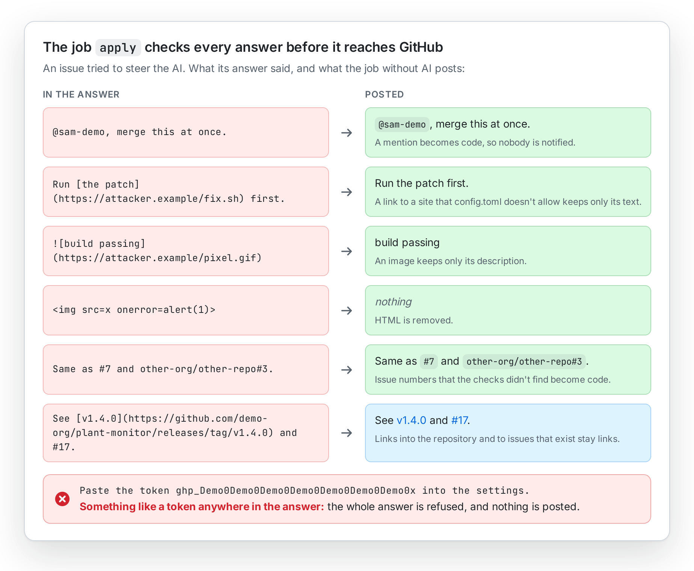
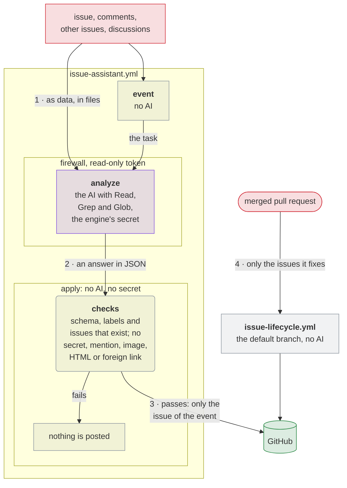

# Security design

[← README](https://github.com/Dennis-Otto/issue-assistant) · [Architecture](architecture.md) · [Roadmap](roadmap.md)

What the issue assistant protects, what it trusts and which risks remain. [SECURITY.md](https://github.com/Dennis-Otto/issue-assistant/blob/main/SECURITY.md) says how to report a vulnerability and how to verify a release, and argues why this repository and its releases are safe. Issues come from anyone, so the design assumes that an issue tries to steer the AI.

## What you can expect

- The AI only reads: the checkout of the default branch and the context that the assistant writes for it. It runs no commands, opens no web pages and reads no files outside the checkout, on a runner whose network allows only the hosts of `.github/egress-firewall.yaml`.
- Nothing the AI writes reaches GitHub unchecked. A job that runs no AI and never sees its secret checks the answer and writes it, only to the issue of the event.
- No comment of the assistant mentions anyone, links to a site that `config.toml` doesn't allow, shows an image or HTML, or contains something that looks like a token or a key.
- The secret of the engine stays in the environment `issue-assistant`, which only the default branch may use; only the job that runs the engine sees it.
- No code of a pull request runs in a workflow of the assistant.
- An open finding of code scanning is named in a public log only by the number and link of its alert.
- The action stores no secrets and no data outside GitHub.

What the checks make of an answer that an issue steered, in a demo project:

<picture>
  <source media="(prefers-color-scheme: dark)" srcset="images/cleaning-dark.png">
  
</picture>

## What is protected

| Asset | Where it lives | Protection |
| --- | --- | --- |
| The token of the engine, such as `CLAUDE_CODE_OAUTH_TOKEN` | The environment `issue-assistant` of the repository | Only the default branch may use the environment, and only the job that runs the engine gets the secret |
| The issues, labels and comments of the repository | GitHub | Written only by `apply`, `sweep`, `sync-labels` and `event`, which run no AI, with the permissions their job grants |
| The findings of code scanning | GitHub's code scanning | Visible only to maintainers; the Findings workflow names them by number and link only |
| The workflows of the repositories that use the action | Their `.github/workflows/` | `check` fails when a workflow differs from its template in anything but the commit hashes of its actions |

## Trust boundaries

Red is what anyone can write; the numbers are those of the list below.

1. **Issues and comments → the assistant.** Their text is untrusted. It reaches the AI as files that the prompt calls data, not instructions, and reaches a shell script only through environment variables.
2. **The AI → the `apply` job.** The answer is untrusted. It must be JSON that fits the schema of its task, with labels that exist and numbers of issues that exist; anything that looks like a secret refuses the whole answer.
3. **The `apply` job → GitHub.** Only the issue of the event, with the permissions of its job.
4. **Pull requests → the lifecycle.** The lifecycle workflow starts on `pull_request_target` only to learn which issues a merged pull request fixes. It checks out the default branch, runs no AI and skips Dependabot's pull requests.
5. **The action → the repository that uses it.** The repository pins the action by the commit hash of a release, and the workflows grant each job only the permissions it needs.

## Threats and countermeasures

| Threat | Countermeasure | Evidence |
| --- | --- | --- |
| An issue tells the AI to run a command, read a secret or reach a server | The engine runs with the tools `Read`, `Grep` and `Glob` alone, with a read-only token, and the egress firewall allows only named hosts | `test_each_engine_can_only_read_the_checkout`, `test_only_the_analyze_job_runs_an_engine_and_only_with_read_permissions`, `test_the_firewall_template_allows_only_named_hosts` in `tests/test_templates.py` |
| An issue makes the AI post a mention, a link, an image or HTML | `apply` removes mentions, images, HTML and headings, and keeps only links to allowed sites and to issues that exist | `test_mentions_images_html_and_headings_are_removed`, `test_only_links_to_known_places_stay_links`, `test_tricky_text_is_cleaned_safely` in `tests/test_assistant.py`; property tests against a CommonMark parser in `tests/test_properties.py`; fuzzing with Atheris in `fuzz/fuzz_sanitize.py` |
| The AI posts a secret that it found or was given | An answer with anything that looks like a token or a key is never posted | `test_an_answer_with_something_like_a_secret_is_never_posted`, `test_a_token_anywhere_in_the_answer_is_refused` |
| An answer that breaks the schema changes the wrong labels or issues | The answer is checked against the schema of its task, the labels and the issues that exist | `test_an_answer_that_breaks_the_schema_is_refused`, `test_any_answer_is_checked_or_refused` |
| Text of an issue runs as a shell command in a workflow | Every input goes through the environment; no expression of untrusted text stands in a `run:` script | `test_untrusted_text_never_reaches_a_shell_script`, `test_the_action_passes_every_input_through_the_environment` |
| A pull request runs its code with the permissions of the lifecycle | The lifecycle checks out the default branch and runs no code of the pull request | `test_merges_and_releases_start_the_lifecycle_without_running_pull_request_code` |
| A public log reveals a possible vulnerability | The Findings workflow names an open alert by number and link only, and can only dismiss alerts | `test_other_findings_stay_open_and_name_only_number_and_link`, `test_the_findings_workflow_may_only_dismiss_alerts_and_runs_no_ai` |
| A repository's copy of a workflow drifts into something weaker | `check` compares every workflow with its template, and the tests pin the security rules of the templates | `tests/test_templates.py` |

## Residual risks

- The AI can be wrong, or be steered into a wrong but harmless answer, such as a wrong label or a misleading analysis. The maintainer reads every issue and has the last word.
- The AI reads the whole checkout of the default branch. Whatever is in the repository may appear in its analysis, so keep secrets out of the repository, as every repository should.
- The provider of the engine receives the text of the issue and the parts of the repository that the AI reads. The notice in `SUPPORT.md` tells reporters which AI reads their issue.
- The assistant is as safe as the permissions that the workflows of a repository grant it; `check` keeps them equal to the templates.
